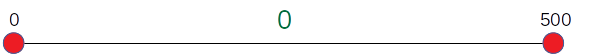
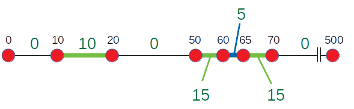

.. highlight:: cpp

Flat Segment Tree
=================

Overview
--------

Flat segment tree is a derivative of `segment tree
<https://en.wikipedia.org/wiki/Segment_tree>`_, and is designed to store
non-overlapping 1-dimensional range values such that *the values of the
neighboring ranges are guaranteed to be different.*  An insertion of a range
value into this structure will always overwrite one or more existing ranges
that overlap with the new range.  If an insertion of a new range would cause
any adjacent ranges to have the equal value, those ranges will be merged into
one range.

An instance of this structure is initialized with fixed lower and upper
bounaries, which will not change throughout the life time of the instance.

The flat segment tree structure consists of two parts: the leaf-node part
which also forms a doubly-linked list, and the non-leaf-node part which forms
a balanced-binary tree and is used only when performing tree-based queries.
The range values are stored in the leaf-nodes, while the non-leaf nodes are
used only for queries.

Quick start
-----------

The following code demonstrates a simple use case of storing non-overlapping
ranged values and performing queries using :cpp:class:`~mdds::flat_segment_tree`:

.. literalinclude:: ../example/flat_segment_tree.cpp
   :language: C++
   :lines: 29-61

Let's walk through this code step-by-step.  The first step is to declare the
instance::

    // Define the begin and end points of the whole segment, and the default
    // value.
    fst_type db(0, 500, 0);

Here, the first and second arguments specify the lower and upper boundaries of
the whole segment.  The third argument specifies the value for the empty
segments.  What this line does is to create a new instance and initializes it
with one initial segment ranging from 0 to 500 with a value of 0.

Internally, this initial range is represented by two leaf nodes, with the
first one storing the start key and the value for the segment both of which
happen to be 0 in this example, and the second one storing the end key of 500.

The following lines insert two new segments into this structure::

    db.insert_front(10, 20, 10);
    db.insert_back(50, 70, 15);

The first line inserts a segment ranging from 10 to 20 with a value of 10, and
the second line from 50 to 70 with a value of 15.

.. figure:: _static/images/fst_example1_insert1.png
   :align: center

You can insert a new segment either via :cpp:func:`~mdds::flat_segment_tree::insert_front`
or :cpp:func:`~mdds::flat_segment_tree::insert_back`.  The end result will be
the same regardless of which method you use; the difference is that
:cpp:func:`~mdds::flat_segment_tree::insert_front` begins its search for
the insertion point from the first node associated with the minimum key value,
whereas :cpp:func:`~mdds::flat_segment_tree::insert_back` starts its search
from the last node associated with the maximum key value.

At this point, the tree contains six leaf nodes in total to represent all
stored segments.  Note that one leaf node represents both the end of a segment
and the start of the adjacent segment that comes after it, unless it's either
the first or the last node.

The next line inserts another segment ranging from 60 to 65 having a value of
5::

    db.insert_back(60, 65, 5);

As this new segment overlaps with the existing segment of 50 to 70, it will
cut into a middle part of that segment to make room for itself.  At this point,
the tree contains eight leaf nodes representing seven segments in total.

The next part queries the value associated with a key value of 15 via
:cpp:func:`~mdds::flat_segment_tree::search`::

    int value = -1;
    long beg = -1, end = -1;

    // Perform linear search.  This doesn't require the tree to be built
    // beforehand.  Note that the begin and end point parameters are optional.
    db.search(15, value, &beg, &end);
    cout << "The value at 15 is " << value << ", and this segment spans from " << beg << " to " << end << endl;;

When executing this code, you will see the following output:

.. code-block:: none

    The value at 15 is 10, and this segment spans from 10 to 20

One thing to note is that the :cpp:func:`~mdds::flat_segment_tree::search`
method performs a linear search which involves traversing only through
the leaf nodes of the structure in order to find the target segment.  As such,
the worst-case lookup performance is directly proportional to the number of
linear nodes.

There is another way to perform the query with better worse-case performance,
that is through :cpp:func:`~mdds::flat_segment_tree::search_tree` as seen in
the following code::

    // Don't forget to build tree before calling search_tree().
    db.build_tree();

    // Perform tree search.  Tree search is generally a lot faster than linear
    // search, but requires the tree to be built beforehand.
    db.search_tree(62, value, &beg, &end);
    cout << "The value at 62 is " << value << ", and this segment spans from " << beg << " to " << end << endl;;

The signature of the :cpp:func:`~mdds::flat_segment_tree::search_tree` method
is identical to that of the :cpp:func:`~mdds::flat_segment_tree::search` method
except for the name.  This code generates the following output:

.. code-block:: none

    The value at 62 is 5, and this segment spans from 60 to 65

Query via :cpp:func:`~mdds::flat_segment_tree::search_tree` generally performs
better since it traverses through the search tree to find the target segment.
But it does require the search tree to be built ahead of time by calling
:cpp:func:`~mdds::flat_segment_tree::build_tree`.

Iterate through stored segments
-------------------------------

:cpp:class:`~mdds::flat_segment_tree` supports two types of iterators to allow
you to iterate through the segments stored in your tree.  The first way is to
iterate through the individual leaf nodes one at a time by using
:cpp:func:`~mdds::flat_segment_tree::begin` and :cpp:func:`~mdds::flat_segment_tree::end`::

    for (auto it = db.begin(); it != db.end(); ++it)
    {
        cout << "key: " << it->first << "; value: " << it->second << endl;
    }

Each iterator value contains a pair of two values named ``first`` and ``second``,
with the first one being the key of the segment that the node initiates, and the
second one being the value associated with that segment.  When executing this
code with the tree from the example code above, you'll get the following output:

.. code-block:: none

    key: 0; value: 0
    key: 10; value: 10
    key: 20; value: 0
    key: 50; value: 15
    key: 60; value: 5
    key: 65; value: 15
    key: 70; value: 0
    key: 500; value: 0

Each node stores the start key and the value of the segment it initiates, and
the key stored in each node is also the end key of the segment that the
previous node initiates except for the first node.

except
for the last node, which stores the end key of the segment the previous note
initiates.  Note that the value stored in the last node is not associated with
any of the segments stored in the tree; in fact it is the default value for
empty segments.

One thing to keep in mind is that :cpp:class:`~mdds::flat_segment_tree` does
not support mutable iterators that let you modify the stored keys or values.

.. note::

   :cpp:class:`~mdds::flat_segment_tree` does not support mutable iterators;
   you can only traverse the values in a read-only fashion.

You can also use range-based for loop to iterate through the leaf nodes in a
similar fashion::

    for (const auto& node : db)
    {
        cout << "key: " << node.first << "; value: " << node.second << endl;
    }

The output from this code is identical to that from the previous one.

Now, one major inconvenience of navigating through the individual leaf nodes
one node at a time is that you need to keep track of the start and end points
of each segment if you need to operate on the segments rather than the nodes
that comprise the segments.  The good news is that :cpp:class:`~mdds::flat_segment_tree`
does provide a way to iterate through the segments directly as the following
code demonstrates::

    for (auto it = db.begin_segment(); it != db.end_segment(); ++it)
    {
        cout << "start: " << it->start << "; end: " << it->end << "; value: " << it->value << endl;
    }

This code uses :cpp:func:`~mdds::flat_segment_tree::begin_segment` and
:cpp:func:`~mdds::flat_segment_tree::end_segment` to iterate through one
segment at a time with each iterator value containing ``start``, ``end`` and
``value`` members that correspond with the start key, end key and the value of
the segment, respectively.  Running this code produces the following output:

.. code-block:: none

    start: 0; end: 10; value: 0
    start: 10; end: 20; value: 10
    start: 20; end: 50; value: 0
    start: 50; end: 60; value: 15
    start: 60; end: 65; value: 5
    start: 65; end: 70; value: 15
    start: 70; end: 500; value: 0

API Reference
-------------

.. doxygenclass:: mdds::flat_segment_tree
   :members:
