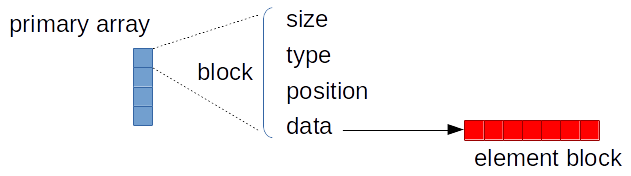
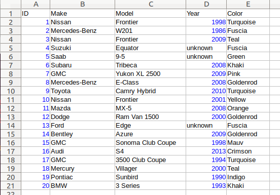

.. highlight:: cpp

Multi Type Vector
=================

Quick start
-----------

The following code demonstrates a simple use case of storing values of double
and :cpp:class:`std::string` types in a single container using :cpp:type:`~mdds::multi_type_vector`.

.. literalinclude:: ../example/multi_type_vector.cpp
   :language: C++
   :start-after: //!code-start
   :end-before: //!code-end

You'll see the following console output when you compile and execute this code:

.. code-block:: none

   numeric block of size 8
    * 1.1
    * 1.2
    * 1.3
    * 10.1
    * 10.2
    * 10.3
    * 10.4
    * 10.5
   empty block of size 2
    - no data -
   string block of size 3
    * Andy
    * Bruce
    * Charlie
   empty block of size 7
    - no data -

   Logical structure between the primary array, blocks, and element blocks.

Each multi_type_vector instance maintains a logical storage structure of one
primary array containing one or more blocks each of which consists of ``type``,
``position``, ``size`` and ``data`` members:

* ``type`` - numeric value representing the block type.
* ``position`` - numeridc value representing the logical position of the first
  element of the block.
* ``size`` - number of elements present in the block a.k.a its logical size.
* ``data`` - pointer to the secondary storage (element block) storing the element
  values.

In this example code, the ``type`` member is referenced to determine its block
type and its logical size is determined from the ``size`` member.  For the
numeric and string blocks, their ``data`` members, which should point to the
memory addresses of their respective element blocks, are dereferenced in order
to print out their element values to stdout inside the ``print_block`` function.

Use custom event handlers
-------------------------

It is also possible to define custom event handlers that get called when
certain events take place.  To define custom event handlers, you need to
define either a class or a struct that has the following methods:

* **void element_block_acquired(mdds::mtv::base_element_block* block)**
* **void element_block_released(mdds::mtv::base_element_block* block)**

as its public methods, specify it as type named ``event_func`` in a trait struct,
and pass it as the second template argument when instantiating your
:cpp:type:`~mdds::multi_type_vector` type.  Refer to :cpp:type:`mdds::mtv::empty_event_func`
for the detail on when each event handler method gets triggered.

The following code example demonstrates how this all works:

.. literalinclude:: ../example/multi_type_vector_event1.cpp
   :language: C++
   :start-after: //!code-start
   :end-before: //!code-end

You'll see the following console output when you compile and execute this code:

.. code-block:: none

   inserting string 'foo'...
     * element block acquired
   inserting string 'bah'...
   inserting int 100...
     * element block acquired
   emptying the container...
     * element block released
     * element block released
   exiting program...

In this example, the **element_block_acquired** handler gets triggered each
time the container creates (thus acquires) a new element block to store a value.
It does *not* get called when a new value is appended to a pre-existing element
block.  Similarly, the **element_block_releasd** handler gets triggered each
time an existing element block storing non-empty values gets deleted.  One
thing to keep in mind is that since these two handlers respond to events related
to element blocks which are owned by non-empty blocks in the primary array,
and empty blocks don't store any element block instances, creations or deletions
of empty blocks don't trigger these event handlers.

The trait also allows you to configure other behaviors of :cpp:type:`~mdds::multi_type_vector`.
Refer to :cpp:type:`mdds::mtv::default_trait` for all available parameters.

Get raw pointer to element block array
--------------------------------------

Sometimes you need to expose a pointer to an element block array
especially when you need to pass such an array pointer to C API that
requires one.  You can do this by calling the ``data`` method of the
element_block template class .  This works since the element block
internally just wraps :cpp:class:`std::vector` (or
:cpp:class:`std::deque` in case the ``MDDS_MULTI_TYPE_VECTOR_USE_DEQUE``
preprocessing macro is defined), and its ``data`` method simply exposes
vector's own ``data`` method which returns the memory location of its
internal array storage.

The following code demonstrates this by exposing raw array pointers to the
internal arrays of numeric and string element blocks, and printing their
element values directly from these array pointers.

.. literalinclude:: ../example/multi_type_vector_element_block1.cpp
   :language: C++
   :start-after: //!code-start
   :end-before: //!code-end

Compiling and execute this code produces the following output:

.. code-block:: none

   block size: 2
   --
   1.1
   1.2
   1.3
   1.4
   1.5
   --
   A
   B
   C
   D
   E

Traverse multiple multi_type_vector instances "sideways"
--------------------------------------------------------

In this section we will demonstrate a way to traverse multiple instances of
:cpp:type:`~mdds::multi_type_vector` "sideways" using the
:cpp:class:`mdds::mtv::collection` class.  What this class does is to wrap
multiple instances of :cpp:type:`~mdds::multi_type_vector` and generate
iterators that let you iterate the individual element values collectively in
the direction orthogonal to the direction of the individual vector instances.

The best way to explain this feature is to use a spreadsheet analogy.  Let's
say we are implementing a data store to store a 2-dimensional tabular data
where each cell in the data set is associated with row and column indices.
Each cell may store a value of string type, integer type, numeric type, etc.
And let's say that the data looks like the following spreadsheet data:

It consists of five columns, with each column storing 21 rows of data.  The
first row is a header row, followed by 20 rows of values.  In this example, We
will be using one :cpp:type:`~mdds::multi_type_vector` instance for each
column thus creating five instances in total, and store them in a
``std::vector`` container.

The declaration of the data store will look like this:

.. literalinclude:: ../example/mtv_collection.cpp
   :language: C++
   :start-after: //!code-start: declare
   :end-before: //!code-end: declare
   :dedent: 4

The first two lines specify the concrete :cpp:type:`~mdds::multi_type_vector`
type used for each individual column and the collection type that wraps the
columns.  The third line instantiates the ``std::vector`` instance to store
the columns, and we are setting its size to five to accommodate for five
columns.  We will make use of the collection_type later in this example after
the columns have been populated.

Now, we need to populate the columns with values.  First, we are setting the
header row:

.. literalinclude:: ../example/mtv_collection.cpp
   :language: C++
   :start-after: //!code-start: header-row
   :end-before: //!code-end: header-row
   :dedent: 4

We are then filling each column individually from column 1 through column 5.
First up is column 1:

.. literalinclude:: ../example/mtv_collection.cpp
   :language: C++
   :start-after: //!code-start: column-1
   :end-before: //!code-end: column-1
   :dedent: 4

Hopefully this code is straight-forward.  It initializes an array of values
and push them to the column one at a time via
:cpp:func:`~mdds::mtv::soa::multi_type_vector::push_back`.  Next up is column 2:

.. literalinclude:: ../example/mtv_collection.cpp
   :language: C++
   :start-after: //!code-start: column-2
   :end-before: //!code-end: column-2
   :dedent: 4

This is similar to the code for column 1, except that because we are using an
array of string literals which implicitly becomes an initializer list of type
``const char*``, we need to explicitly specify the type for the
:cpp:func:`~mdds::mtv::soa::multi_type_vector::push_back` call to be ``std::string``.

The code for column 3 is very similar to this:

.. literalinclude:: ../example/mtv_collection.cpp
   :language: C++
   :start-after: //!code-start: column-3
   :end-before: //!code-end: column-3
   :dedent: 4

Populating column 4 needs slight pre-processing.  We are inserting a string
value of "unknown" in lieu of an integer value of -1.  Therefore the following
code will do:

.. literalinclude:: ../example/mtv_collection.cpp
   :language: C++
   :start-after: //!code-start: column-4
   :end-before: //!code-end: column-4
   :dedent: 4

Finally, the last column to fill, which uses the same logic as for columns 2
and 3:

.. literalinclude:: ../example/mtv_collection.cpp
   :language: C++
   :start-after: //!code-start: column-5
   :end-before: //!code-end: column-5
   :dedent: 4

At this point, the content we've put into the ``columns`` variable roughly
reflects the tabular data shown at the beginning of this section.  Now we can
use the collection type we've declared earlier to wrap the columns:

.. literalinclude:: ../example/mtv_collection.cpp
   :language: C++
   :start-after: //!code-start: wrap
   :end-before: //!code-end: wrap
   :dedent: 4

We are naming this variable ``rows`` since what we are doing with this wrapper
is to traverse the content of the tabular data in row-wise direction.  For
this reason, calling it ``rows`` is quite fitting.

The :cpp:class:`~mdds::mtv::collection` class offers some flexibility as to
how the instances that you are trying to traverse orthogonally are stored.
That being said, you must meet the following prerequisites when passing the
collection of vector instances to the constructor of the
:cpp:class:`~mdds::mtv::collection` class:

1. All :cpp:type:`~mdds::multi_type_vector` instances that comprise the
   collection must be of the same logical length i.e. their
   :cpp:func:`~mdds::mtv::soa::multi_type_vector::size` methods must all return the same
   value.
2. The instances in the collection must be stored in the source container
   either as

   * concrete instances (as in this example),
   * as pointers, or
   * as heap instances wrapped within smart pointer class such as
     ``std::shared_ptr`` or ``std::unique_ptr``.

Although we are storing the vector instances in a ``std::vector`` container in
this example, you have the flexibility to pick a different type of container
to store the individual vector instances as long as it provides STL-compatible
standard iterator functionality.

Additionally, when using the :cpp:class:`~mdds::mtv::collection` class, you
must ensure that the content of the vector instances that it references will
not change for the duration of its use.

Finally, here is the code that does the traversing:

.. literalinclude:: ../example/mtv_collection.cpp
   :language: C++
   :start-after: //!code-start: traverse-row
   :end-before: //!code-end: traverse-row
   :dedent: 4

It's a simple for-loop, and in each iteration you get a single cell node that
contains metadata about that cell including its value.  The node contains the
following members:

* ``type`` - an integer value representing the type of the value.
* ``index`` -  a 0-based index of the :cpp:type:`~mdds::multi_type_vector`
  instance within the collection.  You can think of this as column index in
  this example.
* ``position`` - a 0-based logical element position within each
  :cpp:type:`~mdds::multi_type_vector` instance.  You can think of this as
  row index in this example.

In the current example we are only making use of the ``type`` and ``index``
members, but the ``position`` member will be there if you need it.

The node also provides a convenient ``get()`` method to fetch the value of the
cell.  This method is a template method, and you need to explicitly specify
the element block type in order to access the value.

When executing this code, you will see the following outout:

.. code-block:: none

    ID | Make | Model | Year | Color
    1 | Nissan | Frontier | 1998 | Turquoise
    2 | Mercedes-Benz | W201 | 1986 | Fuscia
    3 | Nissan | Frontier | 2009 | Teal
    4 | Suzuki | Equator | unknown | Fuscia
    5 | Saab | 9-5 | unknown | Green
    6 | Subaru | Tribeca | 2008 | Khaki
    7 | GMC | Yukon XL 2500 | 2009 | Pink
    8 | Mercedes-Benz | E-Class | 2008 | Goldenrod
    9 | Toyota | Camry Hybrid | 2010 | Turquoise
    10 | Nissan | Frontier | 2001 | Yellow
    11 | Mazda | MX-5 | 2008 | Orange
    12 | Dodge | Ram Van 1500 | 2000 | Goldenrod
    13 | Ford | Edge | unknown | Fuscia
    14 | Bentley | Azure | 2009 | Goldenrod
    15 | GMC | Sonoma Club Coupe | 1998 | Mauv
    16 | Audi | S4 | 2013 | Crimson
    17 | GMC | 3500 Club Coupe | 1994 | Turquoise
    18 | Mercury | Villager | 2000 | Teal
    19 | Pontiac | Sunbird | 1990 | Indigo
    20 | BMW | 3 Series | 1993 | LKhaki

which clearly shows that the code has traversed the content of the tabular
data horizontally across columns as intended.

Now, one feature that may come in handy is the ability to limit the iteration
range within the collection.  You can do that by calling either
:cpp:func:`~mdds::mtv::collection::set_collection_range` to limit the column
range or :cpp:func:`~mdds::mtv::collection::set_element_range` to limit the
row range, or perhaps both.

Let's see how this works in the current example.  Here, we are going to limit
the iteration range to only columns 2 and 3, and rows 2 through 11.  The following
code will set this limit:

.. literalinclude:: ../example/mtv_collection.cpp
   :language: C++
   :start-after: //!code-start: limit-range
   :end-before: //!code-end: limit-range
   :dedent: 4

Then iterate through the collection once again:

.. literalinclude:: ../example/mtv_collection.cpp
   :language: C++
   :start-after: //!code-start: traverse-row-range
   :end-before: //!code-end: traverse-row-range
   :dedent: 4

This code is nearly identical to the previous one except for the index values
used to control when to insert column separators and line breaks at the top
and bottom of each iteration.  When executing this code, you'll see the
following output:

.. code-block:: none

    Nissan | Frontier
    Mercedes-Benz | W201
    Nissan | Frontier
    Suzuki | Equator
    Saab | 9-5
    Subaru | Tribeca
    GMC | Yukon XL 2500
    Mercedes-Benz | E-Class
    Toyota | Camry Hybrid
    Nissan | Frontier

which clearly shows that your iteration range did indeed shrink as expected.

Performance Considerations
--------------------------

Select SoA or AoS storage types
^^^^^^^^^^^^^^^^^^^^^^^^^^^^^^^

If you instantiate a multi_type_vector instance via
:cpp:type:`mdds::multi_type_vector`, which is an alias type for
:cpp:class:`mdds::mtv::soa::multi_type_vector`, you will be using the
structure-of-arrays (SoA) variant of its implementation which is new in 2.0.
Prior to 2.0, multi_type_vector used the array-of-structures (AoS) layout which
is still available post 2.0 via :cpp:class:`mdds::mtv::aos::multi_type_vector`
in case you need it.

Note, however, that the SoA variant generally yields better overall performance
since it can make more efficient use of CPU caches.  It is therefore highly
recommended that you stick with the SoA variant unless you have a specific
reason not to.

Also note that both variants are API compatibile with each other.

Use of position hints to avoid the cost of block position lookup
^^^^^^^^^^^^^^^^^^^^^^^^^^^^^^^^^^^^^^^^^^^^^^^^^^^^^^^^^^^^^^^^

Consider the following example code:

.. literalinclude:: ../example/multi_type_vector_pos_hint.cpp
   :language: C++
   :start-after: //!code-start: no-pos-hint
   :end-before: //!code-end: no-pos-hint
   :dedent: 4

which, when executed, may take quite sometime to complete especially when you
are using an older version of mdds.  This particular example exposes one
weakness that multi_type_vector has; because it needs to first look up the
position of the block to operate with, and that lookup *always* starts from the
first block, the time it takes to find the correct block increases as the number
of blocks goes up.  This example demonstrates the worst case scenario of such
lookup complexity since it always inserts the next value at the last block
position.

Fortunately, there is a simple solution to this which the following code
demonstrates:

.. literalinclude:: ../example/multi_type_vector_pos_hint.cpp
   :language: C++
   :start-after: //!code-start: pos-hint
   :end-before: //!code-end: pos-hint
   :dedent: 4

Compiling and executing this code should take only a fraction of a second.

The only difference between the second example and the first one is that the
second one uses an interator as a position hint to keep track of the position of
the last modified block.  Each
:cpp:func:`~mdds::mtv::soa::multi_type_vector::set` method call returns an
iterator which can then be passed to the next
:cpp:func:`~mdds::mtv::soa::multi_type_vector::set` call as the position hint.
Because an iterator object internally stores the location of the block the value
was inserted to, this lets the method to start the block position lookup process
from the last modified block, which in this example is always one block behind
the one the new value needs to go.  Using the big-O notation, the use of the
position hint essentially turns the complexity of O(n^2) in the first example
into O(1) in the second one if you are using an older version of mdds where the
block position lookup had a linear complexity.

This strategy should work with any methods in :cpp:type:`~mdds::multi_type_vector`
that take a position hint as the first argument.

Note that, if you are using a more recent version of mdds (1.6.0 or newer), the
cost of block position lookup is significantly lessoned thanks to the switch to
binary search in performing the lookup.

.. note::

   If you are using mdds 1.6.0 or newer, the cost of block position lookup is
   much less significant even without the use of position hints. But the benefit
   of using position hints may still be there.  It's always a good idea to profile
   your specific use case and decide whether the use of position hints is worth
   it.

One important thing to note is that, as a user, you must ensure that the position
hint you pass stays valid between the calls.  A position hint becomes invalid when
the content of the container changes.  A good strategy to maintain a valid position
hint is to always receive the iterator returned from the mutator method you called
to which you passed the previous position hint, which is what the code above does.
Passing an invalid position hint to a method that takes one may result in invalid
memory access or otherwise in some sort of undefined behavior.

.. warning::

   You must ensure that the position hint you pass stays valid. Passing an invalid
   position hint to a method that takes one may result in invalid memory access
   or otherwise in some sort of undefined behavior.

Block shifting performance and loop-unrolling factor
^^^^^^^^^^^^^^^^^^^^^^^^^^^^^^^^^^^^^^^^^^^^^^^^^^^^

The introduction of binary search in the block position lookup implementation
in version 1.6 has significantly improved its lookup performance, but has
also resulted in slight performance hit when shifting blocks during value
insertion.  This is because when shifting the logical positions of the blocks
below the insertion point, their head positions need to be re-calculated to
account for their new positions.

The good news is that the switch to the structure-of-arrays (SoA) storage
layout in 2.0 alone may bring subtle but measurable improvement in the
block position adjustment performance due to the logical block positions now
being stored in a separate array thereby improving its cache efficiency.  In
reality, however, this was somewhat dependent on the CPU types since some CPU's
didn't show any noticeable improvements or even showed worse performance, while
other CPU types showed consistent improvements with SoA over AoS.

Another factor that may play a role is `loop unrolling <https://en.wikipedia.org/wiki/Loop_unrolling>`_
factor which can be configured via the :cpp:var:`~mdds::mtv::default_trait::loop_unrolling`
variable in your custom trait type if you use version 2.0 or newer.  This variable
is an enum class of type :cpp:type:`mdds::mtv::lu_factor_t` which enumerates
several pre-defined loop-unrolling factors as well as some SIMD features.

The hardest part is to figure out which loop unrolling factor is the best option
in your runtime environment, since it is highly dependent on the environment.
Luckily mdds comes with a tool called `runtime-env <https://gitlab.com/mdds/mdds/-/tree/master/tools/runtime-env>`_
which, when run, will perform some benchmarks and give you the best loop-unrolling
factor in your runtime environment.  Be sure to build this tool with the same
compiler and compiler flags as your target program in order for this tool to give
you a representative answer.

Debugging
---------

Tracing of public methods
^^^^^^^^^^^^^^^^^^^^^^^^^

When using :cpp:class:`~mdds::mtv::soa::multi_type_vector` to handle a series
of data reads and writes in an non-trivial code base, sometimes you may find
yourself needing to track which methods are getting called when following a
certain code path during a debugging session.  In such a situation, you can enable
an optional trace method which gets called whenever a public method of :cpp:class:`~mdds::mtv::soa::multi_type_vector`
is called.

First, you need to define a preprocessor macro named
``MDDS_MULTI_TYPE_VECTOR_DEBUG`` before including the header for
:cpp:class:`~mdds::mtv::soa::multi_type_vector`:

.. literalinclude:: ../example/multi_type_vector_debug_trace.cpp
   :language: C++
   :start-after: //!code-start: header
   :end-before: //!code-end: header

to enable additional debug code.  In this example the value of the macro is
set to 1, but it doesn't matter what the value of the macro is, as long as it
is defined.  You can also define one as a compiler option as well.

Once defined, the next step is to add a ``trace`` method as a static function to
the trait type you pass as a template argument of multi_type_vector:

.. literalinclude:: ../example/multi_type_vector_debug_trace.cpp
   :language: C++
   :start-after: //!code-start: types
   :end-before: //!code-end: types

Here, we are simply inheriting our trait type from the
:cpp:class:`~mdds::mtv::default_trait` type and simply adding a static ``trace``
function to it, and passing this trait type to the mtv_type definition below.
This trace function must take one argument of type
:cpp:class:`mdds::mtv::trace_method_properties_t` which includes various
properties of the traced call.  In this example, we are simply printing the
properties named
:cpp:member:`~mdds::mtv::trace_method_properties_t::function_name` and
:cpp:member:`~mdds::mtv::trace_method_properties_t::function_args` each time a
traced method is called.  Both of these properties are printable string types.

Note that this ``trace`` function is entirely optional; the code will compile
fine even when it's not defined.  Also, it must be declared as static for it to
be called.

Let's instantiate an object of ``mtv_type``, call some of its methods and see
what happens.  When executing the following code:

.. literalinclude:: ../example/multi_type_vector_debug_trace.cpp
   :language: C++
   :start-after: //!code-start: main
   :end-before: //!code-end: main
   :dedent: 4

You will see the following output:

.. code-block:: text

    function:
      name: multi_type_vector
      args: init_size=10
    function:
      name: set
      args: pos=0; value=? (type=5)
    function:
      name: set
      args: pos=2; value=? (type=1)
    function:
      name: set
      args: pos=4; value=? (type=3)
    function:
      name: ~multi_type_vector
      args:

The :cpp:member:`~mdds::mtv::trace_method_properties_t::function_name`
property is hopefully self-explanatory.  The
:cpp:member:`~mdds::mtv::trace_method_properties_t::function_args` property is
a single string value containing the information about the function's
arguments and optionally their values if their values are known to be
printable.  If the value of an argument cannot be printed, ``?`` is placed
instead.  For some argument types, an additional information is displayed e.g.
``(type=5)`` in the above output which indicates that the type of the value
being passed to the function is :cpp:var:`~mdds::mtv::element_type_int32`.

If you want to limit your tracing to a specific function type or types, you
can make use of the :cpp:member:`~mdds::mtv::trace_method_properties_t::type`
property which specifies the type of the traced method.  Likewise, if you want
to only trace methods of a certain instance, use
:cpp:member:`~mdds::mtv::trace_method_properties_t::instance` to filter the
incoming trace calls based on the memory addresses of the instances whose
methods are being traced.

Note that this feature is available for version 2.0.2 and newer, and currently
only available for the SoA variant of :cpp:class:`~mdds::mtv::soa::multi_type_vector`.

.. note::

   This feature is only available for version 2.0.2 and newer, and only for the
   SoA variant.

API Reference
-------------

Core
^^^^

mdds::multi_type_vector
~~~~~~~~~~~~~~~~~~~~~~~

.. doxygentypedef:: mdds::multi_type_vector

mdds::mtv::soa::multi_type_vector
~~~~~~~~~~~~~~~~~~~~~~~~~~~~~~~~~

.. doxygenclass:: mdds::mtv::soa::multi_type_vector
   :members:

mdds::mtv::aos::multi_type_vector
~~~~~~~~~~~~~~~~~~~~~~~~~~~~~~~~~

.. doxygenclass:: mdds::mtv::aos::multi_type_vector
   :members:

mdds::mtv::empty_event_func
~~~~~~~~~~~~~~~~~~~~~~~~~~~

.. doxygenstruct:: mdds::mtv::empty_event_func
   :members:

mdds::mtv::default_trait
~~~~~~~~~~~~~~~~~~~~~~~~

.. doxygenstruct:: mdds::mtv::default_trait
   :members:

Element Blocks
^^^^^^^^^^^^^^

.. doxygenclass:: mdds::mtv::base_element_block
   :members:

.. doxygenclass:: mdds::mtv::element_block
   :members:

.. doxygenstruct:: mdds::mtv::default_element_block
   :members:

.. doxygenclass:: mdds::mtv::copyable_element_block
   :members:

.. doxygenclass:: mdds::mtv::noncopyable_element_block
   :members:

.. doxygenstruct:: mdds::mtv::managed_element_block
   :members:

.. doxygenstruct:: mdds::mtv::noncopyable_managed_element_block
   :members:

.. doxygenstruct:: mdds::mtv::element_block_func
   :members:

Types
^^^^^

mdds::mtv::element_t
~~~~~~~~~~~~~~~~~~~~

.. doxygentypedef:: mdds::mtv::element_t

.. doxygenvariable:: mdds::mtv::element_type_empty
.. doxygenvariable:: mdds::mtv::element_type_boolean
.. doxygenvariable:: mdds::mtv::element_type_int8
.. doxygenvariable:: mdds::mtv::element_type_uint8
.. doxygenvariable:: mdds::mtv::element_type_int16
.. doxygenvariable:: mdds::mtv::element_type_uint16
.. doxygenvariable:: mdds::mtv::element_type_int32
.. doxygenvariable:: mdds::mtv::element_type_uint32
.. doxygenvariable:: mdds::mtv::element_type_int64
.. doxygenvariable:: mdds::mtv::element_type_uint64
.. doxygenvariable:: mdds::mtv::element_type_float
.. doxygenvariable:: mdds::mtv::element_type_double
.. doxygenvariable:: mdds::mtv::element_type_string
.. doxygenvariable:: mdds::mtv::element_type_user_start

mdds::mtv::lu_factor_t
~~~~~~~~~~~~~~~~~~~~~~

.. doxygenenum:: mdds::mtv::lu_factor_t

mdds::mtv::trace_method_t
~~~~~~~~~~~~~~~~~~~~~~~~~

.. doxygenenum:: mdds::mtv::trace_method_t

mdds::mtv::trace_method_properties_t
~~~~~~~~~~~~~~~~~~~~~~~~~~~~~~~~~~~~

.. doxygenstruct:: mdds::mtv::trace_method_properties_t

Exceptions
^^^^^^^^^^

.. doxygenclass:: mdds::mtv::element_block_error

Collection
^^^^^^^^^^

.. doxygenclass:: mdds::mtv::collection
   :members:
