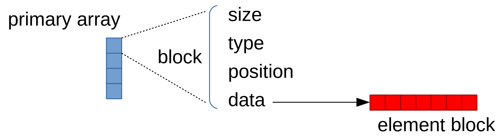

Quick start
===========

The following code demonstrates a simple use case of storing values of double
and :cpp:class:`std::string` types in a single container using :cpp:type:`~mdds::multi_type_vector`.

.. literalinclude:: ../../../example/multi_type_vector/basic.cpp
   :language: C++
   :start-after: //!code-start
   :end-before: //!code-end

You'll see the following console output when you compile and execute this code:

.. code-block:: none

   numeric block of size 8
    * 1.1
    * 1.2
    * 1.3
    * 10.1
    * 10.2
    * 10.3
    * 10.4
    * 10.5
   empty block of size 2
    - no data -
   string block of size 3
    * Andy
    * Bruce
    * Charlie
   empty block of size 7
    - no data -

   Logical structure between the primary array, blocks, and element blocks.

Each multi_type_vector instance maintains a logical storage structure of one
primary array containing one or more blocks each of which consists of ``type``,
``position``, ``size`` and ``data`` members:

* ``type`` - numeric value representing the block type.
* ``position`` - numeridc value representing the logical position of the first
  element of the block.
* ``size`` - number of elements present in the block a.k.a its logical size.
* ``data`` - pointer to the secondary storage (element block) storing the element
  values.

In this example code, the ``type`` member is referenced to determine its block
type and its logical size is determined from the ``size`` member.  For the
numeric and string blocks, their ``data`` members, which should point to the
memory addresses of their respective element blocks, are dereferenced in order
to print out their element values to stdout inside the ``print_block`` function.

.. _standard-element-blocks:

Standard element block types
----------------------------

It is worth noting that the two block types used in the previous example, namely
:cpp:type:`~mdds::mtv::double_element_block` and :cpp:type:`~mdds::mtv::string_element_block`
didn't come out of nowhere.  By default, including the header that defines multi_type_vector
implicitly also defines the following block types:

* :cpp:type:`mdds::mtv::boolean_element_block`
* :cpp:type:`mdds::mtv::int8_element_block`
* :cpp:type:`mdds::mtv::uint8_element_block`
* :cpp:type:`mdds::mtv::int16_element_block`
* :cpp:type:`mdds::mtv::uint16_element_block`
* :cpp:type:`mdds::mtv::int32_element_block`
* :cpp:type:`mdds::mtv::uint32_element_block`
* :cpp:type:`mdds::mtv::int64_element_block`
* :cpp:type:`mdds::mtv::uint64_element_block`
* :cpp:type:`mdds::mtv::float_element_block`
* :cpp:type:`mdds::mtv::double_element_block`
* :cpp:type:`mdds::mtv::string_element_block`

which respectively store elements of the following value types:

* ``bool``
* ``int8_t``
* ``uint8_t``
* ``int16_t``
* ``uint16_t``
* ``int32_t``
* ``uint32_t``
* ``int64_t``
* ``uint64_t``
* ``float``
* ``double``
* ``std::string``

The header also defines the :cpp:class:`mdds::mtv::standard_element_blocks_traits`
struct which you can pass to the :cpp:type:`~mdds::multi_type_vector` template
definition in order to have all of the above mentioned block types and their
respective value types available for use.
