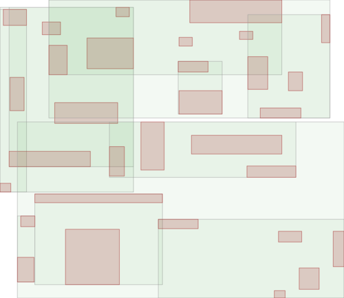
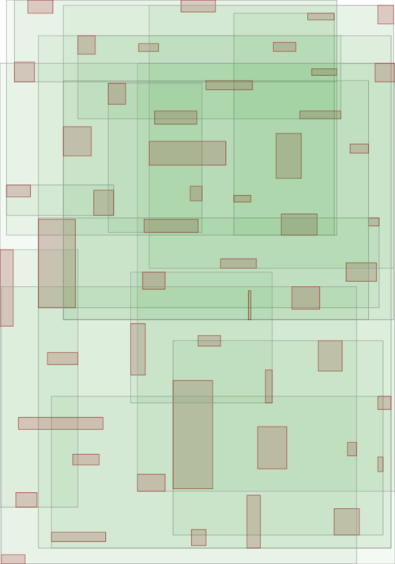
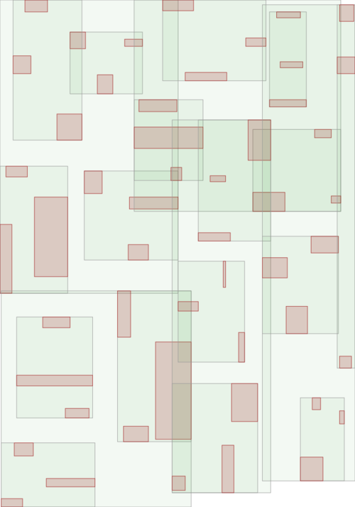

.. highlight:: cpp

R-tree
======

Overview
--------

`R-tree <https://en.wikipedia.org/wiki/R-tree>`_ is a tree-based data
structure designed for optimal query performance on multi-dimensional spatial
objects with rectangular bounding shapes.  The R-tree implementation included
in this library is a variant of R-tree known as `R*-tree
<https://en.wikipedia.org/wiki/R*_tree>`_ which differs from the original
R-tree in that it may re-insert an object if the insertion of that object
would cause the original target directory to overflow.  Such re-insertions
lead to more balanced tree which in turn lead to better query performance, at
the expense of slightly more overhead at insertion time.

Our implementation of R-tree theoretically supports any number of dimensions
although certain functionalities, especially those related to visualization,
are only supported for 2-dimensional instances.

R-tree consists of three types of nodes.  Value nodes store the values
inserted externally and always sit at the bottom of the tree.  Leaf directory
nodes sit directly above the value nodes, and store only value nodes as their
child nodes.  The rest are all non-leaf directory nodes which can either store
leaf or non-leaf directory nodes.

Quick start
-----------

Let's go through a very simple example to demonstrate how to use
:cpp:class:`~mdds::rtree`.  First, you need to specify a concrete type by
specifying the key type and value type to use::

    #include <mdds/rtree.hpp>

    #include <string>
    #include <iostream>

    // key values are of type double, and we are storing std::string as a
    // value for each spatial object.  By default, tree becomes 2-dimensional
    // object store unless otherwise specified.
    using rt_type = mdds::rtree<double, std::string>;

You'll only need to specify the types of key and value here unless you want to
customize other properties of :cpp:class:`~mdds::rtree` including the number
of dimensions.  By default, :cpp:class:`~mdds::rtree` sets the number of
dimensions to 2.

::

    rt_type tree;

Instantiating an rtree instance should be no brainer as it requires no input
parameters.  Now, let's insert some data::

    tree.insert({{0.0, 0.0}, {15.0, 20.0}}, "first rectangle data");

This inserts a string value associated with a bounding rectangle of (0, 0) -
(15, 20).  Note that in the above code we are passing the bounding rectangle
parameter to rtree's :cpp:func:`~mdds::rtree::insert` method as a nested
initializer list, which implicitly gets converted to
:cpp:class:`~mdds::rtree::extent_type`.  You can also use the underlying type
directly as follows::

    rt_type::extent_type bounds({-2.0, -1.0}, {1.0, 2.0});
    std::cout << "inserting value for " << bounds.to_string() << std::endl;
    tree.insert(bounds, "second rectangle data");

which inserts a string value associated with a bounding rectangle of (-2, -1)
to (1, 2).  You may have noticed that this code also uses extent_type's
:cpp:func:`~mdds::rtree::extent_type::to_string` method which returns a string
representation of the bounding rectangle.  This may come in handy when
debugging your code.  This method should work as long as the key type used in
your rtree class overloads ``std::ostream``'s ``<<`` operator function.

Running this code will generate the following output:

.. code-block:: none

    inserting value for (-2, -1) - (1, 2)

As :cpp:class:`~mdds::rtree::extent_type` consists of two members called
``start`` and ``end`` both of which are of type
:cpp:class:`~mdds::rtree::point_type`, which in turn contains an array of keys
called ``d`` whose size equals the number of dimensions, you can modify the
extent directly::

    bounds.start.d[0] = -1.0; // Change the first dimension value of the start rectangle point.
    bounds.end.d[1] += 1.0; // Increment the second dimension value of the end rectangle point.
    std::cout << "inserting value for " << bounds.to_string() << std::endl;
    tree.insert(bounds, "third rectangle data");

This code will insert a string value associated with a rectangle of (-1, -1)
to (1, 3), and will generate the following output:

.. code-block:: none

    inserting value for (-1, -1) - (1, 3)

So far we have only inserted data associated with rectangle shapes, but
:cpp:class:`~mdds::rtree` also allows data associated with points to co-exist
in the same tree.  The following code inserts a string value associated with a
point (5, 6)::

    tree.insert({5.0, 6.0}, "first point data");

Like the verfy first rectangle data we've inserted, we are passing the point
data as an initializer list of two elements (for 2-dimensional data storage),
which will implicitly get converted to :cpp:class:`~mdds::rtree::point_type`
before it enters into the call.

Now that some data have been inserted, it's time to run some queries.  Let's
query all objects that overlap with a certain rectangular region either
partially or fully.  The following code will do just that::

    // Search for all objects that overlap with a (4, 4) - (7, 7) rectangle.
    auto results = tree.search({{4.0, 4.0}, {7.0, 7.0}}, rt_type::search_type::overlap);

    for (const std::string& v : results)
        std::cout << "value: " << v << std::endl;

In this query, we are specifying the search region to be (4, 4) to (7, 7)
which should overlap with the first rectangle data and the first point data.
Indeed, when you execute this code, you will see the following output:

.. code-block:: none

    value: first rectangle data
    value: first point data

indicating that the query region does overlap with two of the stored values

Note that the :cpp:func:`~mdds::rtree::search` method takes exactly two
arguments; the first one specifies the search region while the second two
specifies the type of search to be performed.  In the above call we passed
:cpp:type:`~mdds::detail::rtree::search_type`'s ``overlap`` enum value which
picks up all values whose bounding rectangles overlap with the search region
either partially or fully.

Sometimes, however, you may need to find a value whose bounding rectangle
matches exactly the search region you specify in your query.  You can achieve
that by setting the search type to ``match``.

Here is an example::

    // Search for all objects whose bounding rectangles are exactly (4, 4) - (7, 7).
    auto results = tree.search({{4.0, 4.0}, {7.0, 7.0}}, rt_type::search_type::match);
    std::cout << "number of results: " << std::distance(results.begin(), results.end()) << std::endl;

The search region is identical to that of the previous example, but the search
type is set to ``match`` instead.  Then the next line will count the number of
results and print it out.  The output you will see is as follows:

.. code-block:: none

    number of results: 0

indicating that the results are empty.  That is expected since none of the
objects stored in the tree have an exact bounding rectangle of (4, 4) - (7,
7).  When you change the search region to (0, 0) - (15, 20), however, you'll
get one object back.  Here is the actual code::

    // Search for all objects whose bounding rectangles are exactly (0, 0) - (15, 20).
    auto results = tree.search({{0.0, 0.0}, {15.0, 20.0}}, rt_type::search_type::match);
    std::cout << "number of results: " << std::distance(results.begin(), results.end()) << std::endl;

which is identical to the previous one except for the search resion.  This is
its output:

.. code-block:: none

    number of results: 1

indicating that it has found exactly one object whose bounding rectangle
exactly matches the search region.

It's worth mentioning that :cpp:class:`~mdds::rtree` supports storage of
multiple objects with identical bounding rectangle.  As such, searching with
the search type of ``match`` can return more than one result.

As you may have noticed in these example codes, the
:cpp:class:`~mdds::rtree::search_results` object does provide
:cpp:func:`~mdds::rtree::search_results::begin` and
:cpp:func:`~mdds::rtree::search_results::end` methods that return standard
iterators which you can plug into various iterator algorithms from the STL.
Dereferencing the iterator will return a reference to the stored value i.e.
this line::

    std::cout << "value: " << *results.begin() << std::endl;

which immediately comes after the previous search will output:

.. code-block:: none

    value: first rectangle data

In addition to accessing the value that the iterator references, you can also
query from the same iterator object the bounding rectangle associated with the
value as well as its depth in the tree by calling its
:cpp:func:`~mdds::rtree::iterator_base::extent` and
:cpp:func:`~mdds::rtree::iterator_base::depth` methods, respectively, as in
the following code::

    auto it = results.begin();
    std::cout << "value: " << *it << std::endl;
    std::cout << "extent: " << it.extent().to_string() << std::endl;
    std::cout << "depth: " << it.depth() << std::endl;

Running this code will produce the following output:

.. code-block:: none

    value: first rectangle data
    extent: (0, 0) - (15, 20)
    depth: 1

A depth value represents the distance of the node where the value is stored
from the root node of the tree, and is technically 0-based.  However, you will
never see a depth of 0 in the search results since the root node of a R-tree
is always a directory node, and a directory node only stores other child nodes
and never a value (hence never appears in the search results).

Removing a value from tree
--------------------------

Removing an existing value from the tree first requires you to perform the
search to obtian search results, then from the search results get the iterator
and advance it to the position of the value you wish to remove.  Once you have
your iterator set to the right position, pass it to the
:cpp:func:`~mdds::rtree::erase` method to remove that value.

Note that you can only remove one value at a time, and the iterator becomes
invalid each time you call the :cpp:func:`~mdds::rtree::erase` method to
remove a value.

Here is a contrived example to demonstrate how erasing a value works::

    #include <mdds/rtree.hpp>

    #include <string>
    #include <iostream>

    int main()
    {
        using rt_type = mdds::rtree<int, std::string>;

        rt_type tree;

        // Insert multiple values at the same point.
        tree.insert({1, 1}, "A");
        tree.insert({1, 1}, "B");
        tree.insert({1, 1}, "C");
        tree.insert({1, 1}, "D");
        tree.insert({1, 1}, "E");

        // This should return all five values.
        auto results = tree.search({1, 1}, rt_type::search_type::match);

        for (const std::string& v : results)
            std::cout << v << std::endl;

        // Erase "C".
        for (auto it = results.begin(); it != results.end(); ++it)
        {
            if (*it == "C")
            {
                tree.erase(it);
                break; // This invalidates the iterator.  Bail out.
            }
        }

        std::cout << "'C' has been erased." << std::endl;

        // Now this should only return A, B, D and E.
        results = tree.search({1, 1}, rt_type::search_type::match);

        for (const std::string& v : results)
            std::cout << v << std::endl;

        return EXIT_SUCCESS;
    }

In this code, we are intentionally putting 5 values to the same 2-dimensional
point (1, 1), then removing one of them based on matching criteria (of being
equal to "C").

Compiling and running this code will generate the following output:

.. code-block:: none

    A
    B
    C
    D
    E
    'C' has been erased.
    A
    B
    D
    E

which clearly shows that the 'C' has been successfully erased.

Visualize R-tree structure
--------------------------

In this section we will illustrate a way to visualize an R-tree structure via
:cpp:func:`~mdds::rtree::export_tree` method, which can be useful when you
need to visually inspect the tree structure to see how well balanced it is (or
not).

We will be using the following set of 2-dimensional rectangles as the bounding
rectangles for input values.

For input values, we'll simply use linearly increasing series of integer
values, but the values themselves are not the focus of this section, and we'll
not talk much about that.  We will also intentionally make the capacity of
directory nodes smaller so that the tree will split more frequently during
insertion even for smaller number of inputs.

Now, let's take a look at the code::

    #include <mdds/rtree.hpp>

    #include <iostream>
    #include <fstream>

    // Make the node capacity intentionally small.
    struct tiny_trait_2d
    {
        constexpr static size_t dimensions = 2;
        constexpr static size_t min_node_size = 2;
        constexpr static size_t max_node_size = 5;
        constexpr static size_t max_tree_depth = 100;

        constexpr static bool enable_forced_reinsertion = true;
        constexpr static size_t reinsertion_size = 2;
    };

    using rt_type = mdds::rtree<int, int, tiny_trait_2d>;

    int main()
    {
        // 2D rectangle with the top-left position (x, y), width and height.
        struct rect
        {
            int x;
            int y;
            int w;
            int h;
        };

        std::vector<rect> rects =
        {
            {  3731,  2433, 1356,  937 },
            {  6003,  3172, 1066,  743 },
            {  4119,  6403,  825, 1949 },
            { 10305,  2315,  776,  548 },
            { 13930,  5468, 1742,  626 },
            {  8614,  4107, 2709, 1793 },
            { 14606,  1887, 5368, 1326 },
            { 17990,  5196, 1163, 1911 },
            {  6728,  7881, 3676, 1210 },
            { 14704,  9789, 5271, 1092 },
            {  4071, 10723, 4739,  898 },
            { 11755,  9010, 1357, 2806 },
            { 13978,  4068,  776,  509 },
            { 17507,  3717,  777,  471 },
            { 20358,  6092,  824, 1093 },
            {  6390,  4535, 1066, 1715 },
            { 13978,  7182, 2516, 1365 },
            { 17942, 11580, 2854,  665 },
            {  9919, 10450,  873, 1716 },
            {  5568, 13215, 7446,  509 },
            {  7357, 15277, 3145, 3234 },
            {  3539, 12592,  631,  509 },
            {  4747, 14498,  825,  626 },
            {  4554, 16913,  969, 1443 },
            { 12771, 14693, 2323,  548 },
            { 18714,  8193, 2372,  586 },
            { 22292,  2743,  487, 1638 },
            { 20987, 17535, 1163, 1249 },
            { 19536, 18859,  632,  431 },
            { 19778, 15394, 1356,  626 },
            { 22969, 15394,  631, 2066 },
        };

        rt_type tree;

        // Insert the rectangle objects into the tree.
        int value = 0;
        for (const auto& rect : rects)
            tree.insert({{rect.x, rect.y}, {rect.x + rect.w, rect.y + rect.h}}, value++);

        // Export the tree structure as a SVG for visualization.
        std::string tree_svg = tree.export_tree(rt_type::export_tree_type::extent_as_svg);
        std::ofstream fout("bounds.svg");
        fout << tree_svg;

        return EXIT_SUCCESS;
    }

First, we need to talk about how the concrete rtree type is instantiated::

    // Make the node capacity intentionally small.
    struct tiny_trait_2d
    {
        constexpr static size_t dimensions = 2;
        constexpr static size_t min_node_size = 2;
        constexpr static size_t max_node_size = 5;
        constexpr static size_t max_tree_depth = 100;

        constexpr static bool enable_forced_reinsertion = true;
        constexpr static size_t reinsertion_size = 2;
    };

    using rt_type = mdds::rtree<int, int, tiny_trait_2d>;

The first and second template arguments specify the key and value types to be
both ``int``.  This time around, however, we are passing a third template
argument which is a struct containing several static constant values.  These
constant values define certain characteristics of your R-tree, and there are
some restrictions you need to be aware of in case you need to use your own
custom trait for your R-tree.  Refer to
:cpp:class:`~mdds::detail::rtree::default_rtree_traits`, which is the default
trait used when you don't specify your own, for the descriptions of the
individual constants that your trait struct is expected to have as well as
restrictions that you must be aware of.

Also be aware that these constants must all be constant expressions with
``constexpr`` specifiers, as some of them are used within ``static_assert``
declarations, and even those that are currently not used within
``static_assert`` may be used in ``static_assert`` in the future.

As far as our current example goes, the only part of the custom trait we need
to highlight is that we are setting the directory node size to 2-to-5 instead
of the default size of 40-to-100, to trigger more node splits and make the
tree artificially deeper.

Let's move on to the next part of the code::

    // 2D rectangle with the top-left position (x, y), width and height.
    struct rect
    {
        int x;
        int y;
        int w;
        int h;
    };

    std::vector<rect> rects =
    {
        {  3731,  2433, 1356,  937 },
        {  6003,  3172, 1066,  743 },
        {  4119,  6403,  825, 1949 },
        { 10305,  2315,  776,  548 },
        { 13930,  5468, 1742,  626 },
        {  8614,  4107, 2709, 1793 },
        { 14606,  1887, 5368, 1326 },
        { 17990,  5196, 1163, 1911 },
        {  6728,  7881, 3676, 1210 },
        { 14704,  9789, 5271, 1092 },
        {  4071, 10723, 4739,  898 },
        { 11755,  9010, 1357, 2806 },
        { 13978,  4068,  776,  509 },
        { 17507,  3717,  777,  471 },
        { 20358,  6092,  824, 1093 },
        {  6390,  4535, 1066, 1715 },
        { 13978,  7182, 2516, 1365 },
        { 17942, 11580, 2854,  665 },
        {  9919, 10450,  873, 1716 },
        {  5568, 13215, 7446,  509 },
        {  7357, 15277, 3145, 3234 },
        {  3539, 12592,  631,  509 },
        {  4747, 14498,  825,  626 },
        {  4554, 16913,  969, 1443 },
        { 12771, 14693, 2323,  548 },
        { 18714,  8193, 2372,  586 },
        { 22292,  2743,  487, 1638 },
        { 20987, 17535, 1163, 1249 },
        { 19536, 18859,  632,  431 },
        { 19778, 15394, 1356,  626 },
        { 22969, 15394,  631, 2066 },
    };

This ``rects`` variable holds an array of 2-dimensional rectangle data that
represent the positions and sizes of rectangles shown earlier in this section.
This will be used as bounding rectangles for the input values in the next part
of the code::

    rt_type tree;

    // Insert the rectangle objects into the tree.
    int value = 0;
    for (const auto& rect : rects)
        tree.insert({{rect.x, rect.y}, {rect.x + rect.w, rect.y + rect.h}}, value++);

Here, the tree is instantiated, and the rectangles are inserted with their
associated values one at a time.  Once the tree is populated, the code that
follows will export the structure of the tree as an SVG string, which will
then be saved to a file on disk::

    // Export the tree structure as a SVG for visualization.
    std::string tree_svg = tree.export_tree(rt_type::export_tree_type::extent_as_svg);
    std::ofstream fout("bounds.svg");
    fout << tree_svg;

When you open the exported SVG file named **bounds.svg** in a SVG viewer,
you'll see something similar to this:

which depicts not only the bounding rectangles of the inserted values
(the red rectangles), but also the bounding rectangles of the directory
nodes as well (the light green rectangles).

Bulk-loading data
-----------------

In this section we will explore on how to bulk-load data into an
:cpp:class:`~mdds::rtree` instance via rtree's own
:cpp:class:`~mdds::rtree::bulk_loader` class.  In this example, we'll be using
the same custom trait we've used in the previous section in order to
artificially promote the rate of node splits.  The first part of the code::

    #include <mdds/rtree.hpp>

    #include <iostream>
    #include <fstream>

    // Make the node capacity intentionally small.
    struct tiny_trait_2d
    {
        constexpr static size_t dimensions = 2;
        constexpr static size_t min_node_size = 2;
        constexpr static size_t max_node_size = 5;
        constexpr static size_t max_tree_depth = 100;

        constexpr static bool enable_forced_reinsertion = true;
        constexpr static size_t reinsertion_size = 2;
    };

    using rt_type = mdds::rtree<int, int, tiny_trait_2d>;

is pretty much identical to the example in the last section.  The next part of
the code defines what bounding rectangles to be inserted.  Here, we are using
a different set of rectangles than the previous example to illustrate the
difference between a series of normal insertions and bulk-loading::

    // 2D rectangle with the top-left position (x, y), width and height.
    struct rect
    {
        int x;
        int y;
        int w;
        int h;
    };

    std::vector<rect> rects =
    {
        {  3538,  9126, 1908,  1908 },
        { 34272, 52053, 2416,  2543 },
        { 32113,  9761, 2416,   638 },
        { 16493, 16747, 7369,  2289 },
        { 29192, 23732, 3432,  2035 },
        { 35797, 17000, 1781,   892 },
        { 15857, 29319, 2162,  1654 },
        {  5825, 24239, 3559,  8512 },
        {  9127, 46846, 2543,  1019 },
        {  7094, 54338, 5210,   892 },
        { 18779, 39734, 3813, 10417 },
        { 32749, 35923, 2289,  2924 },
        { 26018, 31098,  257,  2797 },
        {  6713, 37066, 2924,  1146 },
        { 19541,  3157, 3305,  1146 },
        { 21953, 10904, 4448,   892 },
        { 15984, 24240, 5210,  1273 },
        {  8237, 15350, 2670,  2797 },
        { 17001, 13826, 4067,  1273 },
        { 30970, 13826, 3940,   765 },
        {  9634,  6587, 1654,  1781 },
        { 38464, 47099,  511,  1400 },
        { 20556, 54085, 1400,  1527 },
        { 37575, 24113, 1019,   765 },
        { 20429, 21064, 1146,  1400 },
        { 31733,  4427, 2543,   638 },
        {  2142, 27161, 1273,  7369 },
        {  3920, 43289, 8131,  1146 },
        { 14714, 34272, 1400,  4956 },
        { 38464, 41258, 1273,  1273 },
        { 35542, 45703,  892,  1273 },
        { 25891, 50783, 1273,  5083 },
        { 35415, 28431, 2924,  1781 },
        { 15476,  7349, 1908,   765 },
        { 12555, 11159, 1654,  2035 },
        { 11158, 21445, 1908,  2416 },
        { 23350, 28049, 3432,   892 },
        { 28684, 15985, 2416,  4321 },
        { 24620, 21953, 1654,   638 },
        { 30208, 30716, 2670,  2162 },
        { 26907, 44179, 2797,  4067 },
        { 21191, 35416, 2162,  1019 },
        { 27668, 38717,  638,  3178 },
        {  3666, 50528, 2035,  1400 },
        { 15349, 48750, 2670,  1654 },
        { 28430,  7221, 2162,   892 },
        {  4808,  3158, 2416,  1273 },
        { 38464,  3666, 1527,  1781 },
        {  2777, 20937, 2289,  1146 },
        { 38209,  9254, 1908,  1781 },
        {  2269, 56497, 2289,   892 },
    };

As with the previous example, each line contains the top-left position as well
as the size of a rectangle.  We are now going to insert these rectangles in
two different ways.

First, we insert them via normal :cpp:func:`~mdds::rtree::insert` method::

    void load_tree()
    {
        rt_type tree;

        // Insert the rectangle objects into the tree.
        int value = 0;
        for (const auto& rect : rects)
            tree.insert({{rect.x, rect.y}, {rect.x + rect.w, rect.y + rect.h}}, value++);

        // Export the tree structure as a SVG for visualization.
        std::string tree_svg = tree.export_tree(rt_type::export_tree_type::extent_as_svg);
        std::ofstream fout("bounds2.svg");
        fout << tree_svg;
    }

This code should look familiar since it's nearly identical to the code in the
previous section.  After the insertion is done, we export the tree as an SVG
to visualize its structure.

Next, we insert the same set of rectangles via
:cpp:class:`~mdds::rtree::bulk_loader`::

    void bulkload_tree()
    {
        rt_type::bulk_loader loader;

        // Insert the rectangle objects into the tree.
        int value = 0;
        for (const auto& rect : rects)
            loader.insert({{rect.x, rect.y}, {rect.x + rect.w, rect.y + rect.h}}, value++);

        // Start bulk-loading the tree.
        rt_type tree = loader.pack();

        // Export the tree structure as a SVG for visualization.
        std::string tree_svg = tree.export_tree(rt_type::export_tree_type::extent_as_svg);
        std::ofstream fout("bounds2-bulkload.svg");
        fout << tree_svg;
    }

Inserting via :cpp:class:`~mdds::rtree::bulk_loader` shouldn't be too
different than inserting via rtree's own insert methods.  The only
difference is that you instantiate a
:cpp:class:`~mdds::rtree::bulk_loader` instance to insert all your data
to it, then call its :cpp:func:`~mdds::rtree::bulk_loader::pack` method
at the end to construct the final :cpp:class:`~mdds::rtree` instance.

When the insertion is done and the tree instance created, we are once again
exporting its structure to an SVG file for visualization.

There are primarily two advantages to using
:cpp:class:`~mdds::rtree::bulk_loader` to load data.  First, unlike the
normal insertion, bulk-loading does not trigger re-insertion nor node
splits on the fly.  Second, a tree created from bulk loader is typically
well balanced than if you insert the same data through normal insertion.
That is because the bulk loader sorts the data with respect to their
bounding rectangles ahead of time and partition them evenly.  The tree
is then built from the bottom-up.  You can visually see the effect of
this when comparing the two trees built in our current example.

The first one is from the tree built via normal insertion:

The top part of the picture looks very "busy" indicated by a darker
green area representative of more directory nodes overlaping with each
other.  In general, the rectangles look bigger and show higher degree of
overlaps.

This one, on the other hand, is from the tree built with the same data
set but through bulk-loading:

The rectangles generally look smaller and show much less overlaps than the
previous picture, which is considered to be a more balanced R-tree structure.

API Reference
-------------

.. doxygenclass:: mdds::rtree
   :members:

.. doxygenstruct:: mdds::detail::rtree::default_rtree_traits
   :members:

.. doxygenstruct:: mdds::detail::rtree::integrity_check_properties
   :members:

.. doxygenenum:: mdds::detail::rtree::export_tree_type
   :project: mdds

.. doxygenenum:: mdds::detail::rtree::search_type
   :project: mdds
