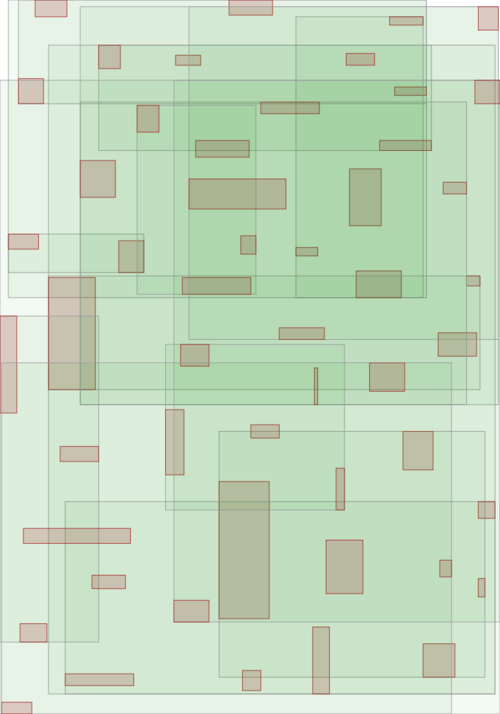

.. highlight:: cpp

Bulk-loading data
=================

In this section we will explore on how to bulk-load data into an
:cpp:class:`~mdds::rtree` instance via rtree's own
:cpp:class:`~mdds::rtree::bulk_loader` class.  In this example, we'll be using
the same custom trait we've used in the previous section in order to
artificially promote the rate of node splits.  The first part of the code:

.. literalinclude:: ../../example/rtree_medium_bulkload.cpp
   :language: C++
   :start-after: //!code-start: tree-type
   :end-before: //!code-end: tree-type

is pretty much identical to the example in the last section.  The next part of
the code defines what bounding rectangles to be inserted.  Here, we are using a
somewhat larger rectangle set than the one used in the previous example to
better highlight the difference between normal insertions and bulk-loading:

.. literalinclude:: ../../example/rtree_medium_bulkload.cpp
   :language: C++
   :start-after: //!code-start: input-data
   :end-before: //!code-end: input-data

As with the previous example, each line in the ``rects`` initialization block
contains the top-left position of a rectangle (``x`` and ``y``) as well as its
size (``w`` and ``h``).  But unlike the previous example, We are going to insert
them in two different ways.

First, we are going to insert them via normal :cpp:func:`~mdds::rtree::insert()`
method:

.. literalinclude:: ../../example/rtree_medium_bulkload.cpp
   :language: C++
   :start-after: //!code-start: normal-load
   :end-before: //!code-end: normal-load
   :dedent: 4

This code should look familiar since it's nearly identical to the code in the
previous example.  After the insertion is done, we export the tree as an SVG
to visualize its structure.

Next, we insert the same set of rectangles via
:cpp:class:`~mdds::rtree::bulk_loader`:

.. literalinclude:: ../../example/rtree_medium_bulkload.cpp
   :language: C++
   :start-after: //!code-start: bulkload
   :end-before: //!code-end: bulkload
   :dedent: 4

Inserting via :cpp:class:`~mdds::rtree::bulk_loader` shouldn't be too different
than inserting via rtree's own insert methods.  The only difference is that you
instantiate a :cpp:class:`~mdds::rtree::bulk_loader` instance to insert all your
data to it first, then call its :cpp:func:`~mdds::rtree::bulk_loader::pack()`
method at the end to construct the final :cpp:class:`~mdds::rtree` instance.

When the insertion is done and the tree instance created, we are once again
exporting its structure to an SVG file for visualization.

There are primarily two advantages to using
:cpp:class:`~mdds::rtree::bulk_loader` to load data.  First, unlike the normal
insertion, bulk-loading does not trigger dynamic re-insertion nor node splits
during insertion.  Second, a tree created from the bulk loader is typically well
balanced than if you insert the same data through normal insertion.  That is
because the bulk loader sorts the data with respect to their bounding rectangles
ahead of time to partition them evenly.  The tree is then populated from the
bottom-up.  You can visually see the effect of this when comparing the two trees
built in our current example.

The first one is from the tree built via normal insertion:

The top part of the picture looks very "busy" indicated by a darker green area
indicative of more directory nodes overlaping with each other.  In general, the
bounding rectangles look bigger and are more overlapped.

The one below, on the other hand, is from the tree built with the same data
set but through bulk-loading:

.. figure:: ../_static/images/rtree_bounds2_tree_bulkload.png
   :align: center

The bounding rectangles generally look smaller and show much less overlaps than
the previous tree - traits indicative of a more balanced R-tree structure.
