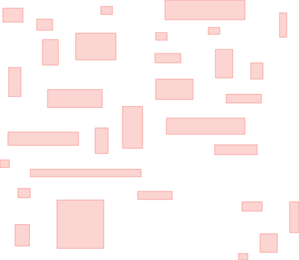

.. highlight:: cpp

Visualize R-tree structure
==========================

In this section we will illustrate a way to visualize the structure of an R-tree
via :cpp:func:`~mdds::rtree::export_tree()`, which can be useful when you need
to visually inspect the tree structure to see how well balanced it is (or not).

We will be using the following set of 2-dimensional rectangles as the bounding
rectangles for input values.

For input values, we'll simply use linearly increasing series of integer values,
but the values themselves are not the focus of this section, so we'll not focus
much on that.  We will also intentionally make the capacity of the directory
nodes smaller so that the tree will split more frequently during insertion even
with smaller number of inputs.

First, we need to talk about how the concrete rtree type is defined:

.. literalinclude:: ../../example/rtree_medium.cpp
   :language: C++
   :start-after: //!code-start: tree-type
   :end-before: //!code-end: tree-type

The first and second template arguments specify the key and value types to be
both ``int``.  This time around, however, we are specifying the third template
argument to be a struct containing several static constant values.  These
constant values define various traits of your R-tree, and there are some
constraints you need to be aware of in case you need to define your own custom
traits.  Refer to :cpp:class:`~mdds::detail::rtree::default_rtree_traits`, which
is the default traits used when you don't specify a custom one, for the
descriptions of the individual constants that your traits struct is expected to
include as well as their constraints.

Also be aware that these constants must all be constant expressions with
``constexpr`` specifiers, as some of them are used within ``static_assert``
declarations, and even those that are currently not used within
``static_assert`` may be used in ``static_assert`` in the future.

The only part of the custom traits we need to highlight in our current example
is that we are setting the directory node size to 2 to 5 instead of the default
size of 40 to 100, to trigger more node splits and make the tree artificially
deeper.

Let's move on to the next part of the code:

.. literalinclude:: ../../example/rtree_medium.cpp
   :language: C++
   :start-after: //!code-start: input-data
   :end-before: //!code-end: input-data
   :dedent: 4

This ``rects`` variable holds an array of 2-dimensional rectangle data that
represent the positions and sizes of rectangles shown earlier in this section.
This will be used as bounding rectangles for the input values in the next part
of the code:

.. literalinclude:: ../../example/rtree_medium.cpp
   :language: C++
   :start-after: //!code-start: insert
   :end-before: //!code-end: insert
   :dedent: 4

Here, the tree is instantiated, and the input rectangles are inserted with their
associated values one at a time.  Once the tree is populated, the code that
follows will export the structure of the tree as an SVG string, which will
then be saved to a file on disk:

.. literalinclude:: ../../example/rtree_medium.cpp
   :language: C++
   :start-after: //!code-start: export
   :end-before: //!code-end: export
   :dedent: 4

When you open the exported SVG file named **bounds.svg** in a SVG viewer,
you'll see something similar to this:

.. figure:: ../_static/images/rtree_bounds_tree.png
   :align: center

which depicts not only the bounding rectangles of the inserted values
(the red rectangles), but also the bounding rectangles of the directory
nodes as well (the light green rectangles).
